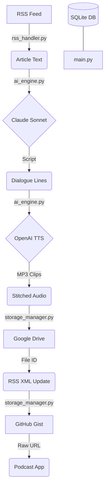

# RSS Podcast Maker 🎙️🤖

Transform any RSS feed (like Substack) into a professional, two-host AI podcast. This tool uses Anthropic's Claude to write scripts and OpenAI's TTS to generate high-quality audio, then hosts the feed for you. Now upgraded for production usage with Multi-Show support, SQLite storage, and Dockerization.

## ✨ Features
- **Multi-Show Multi-Tenancy**: Run multiple independent podcast shows in a single execution.
- **Two-Host Dialogue**: Generates argumentative, high-energy discussions between two AI hosts.
- **SQLite Storage**: Robust tracking of processed articles with item metadata and show isolation.
- **Drive Hosting**: Uploads MP3s to Google Drive using direct-download links.
- **GitHub Gist RSS**: Hosts your RSS feed on GitHub Gists for 100% reliable subscription.
- **Dockerized**: reproducible environment with FFmpeg built-in.

## 🏗️ Architecture


## 🚀 Setup

### Docker (Recommended)
The easiest way to run the project with all dependencies (including FFmpeg) is via Docker:
```bash
docker-compose up --build
```

### Manual Setup

#### 1. Requirements
- Python 3.10+
- **FFmpeg**: Required for audio processing if NOT using Docker.

#### 2. Installation
```bash
git clone https://github.com/yourusername/RSS-podcast-maker.git
cd RSS-podcast-maker
python -m venv venv
source venv/bin/activate  # Windows: venv\Scripts\activate
pip install -r requirements.txt
```

### 3. API Keys (.env)
Create a `.env` file in the root directory:
```env
ANTHROPIC_API_KEY=your_anthropic_key
OPENAI_API_KEY=your_openai_key
GITHUB_TOKEN=your_github_token_with_gist_scope
```

### 4. Configuration
Copy `config.example.yaml` to `config.yaml`. The new structure supports a list of `shows`. Each show can have its own feeds, Drive folder, and Gist.

### 5. Google Drive Authentication
1. Go to the [Google Cloud Console](https://console.cloud.google.com/).
2. Create a project and enable the **Google Drive API**.
3. Create **OAuth 2.0 Client ID** credentials (Desktop App).
4. Download the JSON and save it as `client_secrets.json` in the project root.

## 🛠️ Usage
Run the orchestration loop:
```bash
python main.py
```
Or via Docker:
```bash
docker-compose up
```

### Data Migration
If you have an old `processed.json` file, migrate it to the new SQLite database:
```bash
python migrate_processed.py
```

## 🧪 Testing
The project includes a testing suite using `pytest`.
```bash
pytest
```
Recent additions include `tests/test_db_manager.py` for verifying SQLite logic.

## 🤝 Contributing
Contributions are welcome! Please see [CONTRIBUTING.md](CONTRIBUTING.md) for details.

## ⚖️ License
MIT License. See [LICENSE](LICENSE) for details.

